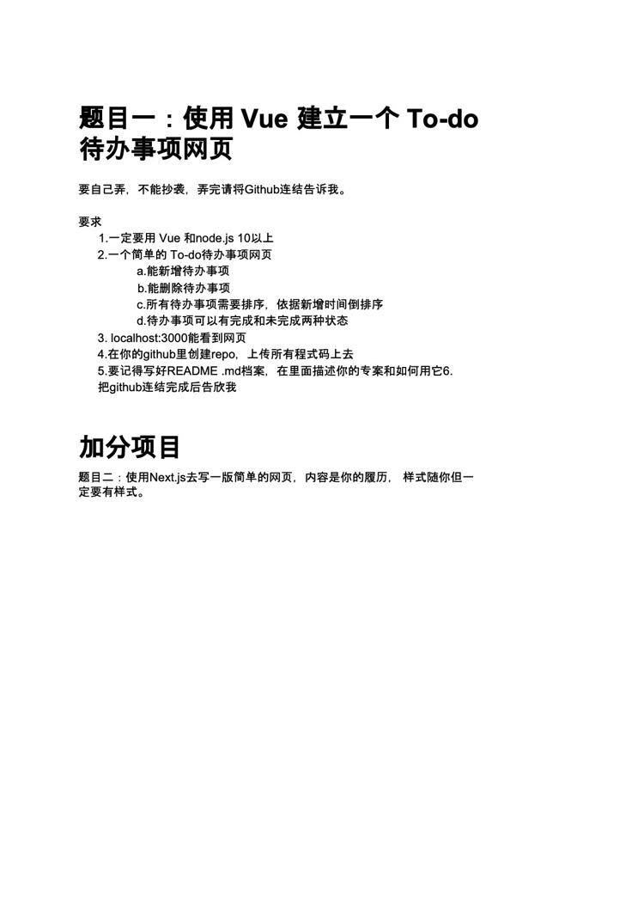
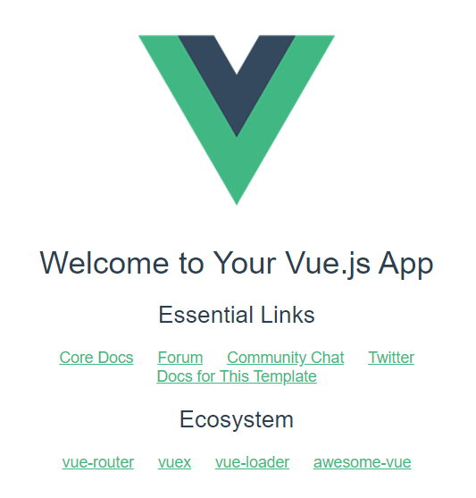
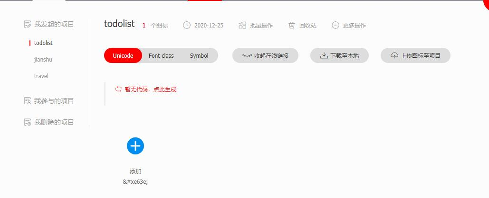
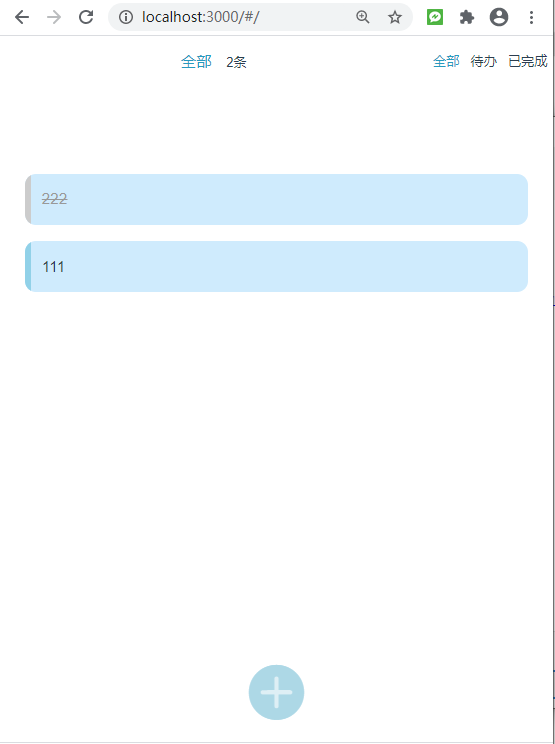

# todo

**@Author：Runsen**



Github创建项目，电脑本地进行远程连接，

```
git init
git remote add origin https://github.com/MaoliRUNsen/todo.git
```


Vue项目Todo项目，编辑器Vscode。

```
npm install vue
npm install cnpm 
npm install -g webpack # 安装webpack
npm install --global todo # 全局安装脚手架工具
vue init webpack todo # 创建项目（在原有的文件夹中创建，这样可以将名字同步）
cd todo
npm run dev
```

访问成功8080端口，




```
git add .
git commit -m '初始化项目成功'
git push  origin master
```

查看Github，同步代码成功。

下一步webpack配置：在config/index.js换3000端口， 重启项目，访问成功3000端口。

##  Todolist项目开发

直接用HelloWorld.vue 替代 为TodoItem.vue 。路由和入口文件main.js不用动，把路由route/index中的HelloWorld替换成TodoItem。

分析需求

- 需要有全部，已完成，未完成的状态。需要上简单的TodoList进行额外的开发，

参考微信小程序和手机上备忘录的Todolist。

设想画面，最底层下面有一个 加号的 添加Todo的图标，点击图标 弹出窗口，写上内容，右侧有创建的点击事件。

最上面应该是全部，待办，已完成。

在阿里巴巴图标库创建项目，TodoList




下载到本地，提取出iconfont.css以及其他四个文件放进static目录。

在vue中使用图标显示成功。

```
<span>&#xe63e;</span>
```

布局template模块。

头部代码todo-header-left和todo-header-right。在todo-header-right有三个item对应三个状态。

todo-header布局fixed

todo-header-right中的item采用flex布局，flex-shrink 0 等分计算

状态栏的左侧有两个东西，一个当前状态，一个内容数。

因此，第一步需要点击todo-header-right，todo-header-left当前状态进行同步。

在vue中定义data数据activeIndex，表示当前的三个中的index。

状态栏的右侧 的item绑定@click点击事件。

传入当前的index的参数，该方法为tab，在methods中写。

activeIndex默认是0，全部，tab中修改activeIndex。

vue中定义data数据list，就是TodoList的内容，一开始将list写死。

下面就是在状态栏的左侧判断list的长度，使用computed计算属性，listData函数可以在template直接使用。

vue中定义data数据text，表示左边的文本。

listData函数返回的是长度，同时也要更新text的数据，判断activeIndex即可。


下面就是图标的点击事件。

图标布局左右居中，justify-content: center; x轴对齐方式，align-items:center;    y轴对齐方式

需要点击弹出输入框，而且有旋转效果，旋转效果 CSS  transition  transform


在外层创建div绑定点击事件create，在数据中定义textShow表示弹出框是否展示，这里的textShow还可以来判断头部是否展示。

设置动画时间 0.3s。 transition: all 0.3s;

再分别定义close和open函数

open 设置    this.textShow = true， close：   this.textShow = false

然后对textShow 通过v-if判断  也可以用v-show。

下面就是输入框 和按钮的布局，在icon的上面50px的即可。、

对按钮进行点击事件的监听，add。输入值需要在data设置 value，下面就是vue 的TodoList代码思路

之前使用引入vue.js实现todolist的添加和删除。

```
<body>
  <div id="app">
    <input type="text" v-model = "value">
    <button @click = "HandleBtnClick">提交</button>
    <ul>
      <!-- <li v-for="item in list">{{item}}</li> -->
      <!-- 通过v-bind:content绑住item，然后这里的content传到component中的TodoItem组件 -->
      <todo-item v-bind:content="item"
                 v-bind:index = "index" 
                 v-for="(item,index) in list"
                 @delete="HandleItemDelete">
      </todo-item>
    </ul>
  </div>
  <script>
    var TodoItem = {
      // 局部组件的数据
      props:["content","index"],
      // template :  "<li>" + this.content +  "</li>"  不然会出现undefined
      // 这里需要用插值表达式进行传参
      template :  "<li @click='HandleItemClick'>{{content}}</li>",
      methods: {
        HandleItemClick:function(){
          this.$emit("delete",this.index)
        }
      },
    }
    var app = new Vue({
      el: "#app",
      // 将TodoItem写在里面就是局部组件
      components:{
        TodoItem:TodoItem
      },
      data : {
        list : [],
        value : "",
      },
      methods: {
        HandleBtnClick:function(){
          this.list.push(this.value)
          this.value  = ""
        },
        HandleItemDelete:function(index){
          this.list.splice(index,1)
        }
      },
    })
  </script>
</body>
```

输入框 v-model ，在触发 input 事件时去更新 value 值，添加add事件，判断value是否为空，

列表unshift 将添加的value放在头部。因为需要对当前事件判断是否完成，写成json  ，   添加id 和 checked:

 checked设置false，说明当前没有完成，id写成时间`new Date().getTime(),` 。

value为空，再进行close函数。


下面对列表进行v-for循环渲染，再子数据在绑定点击事件finish，当点击需要传入当前的id。

finish函数需要从当前id找到对应列表的index，然后把checked设置true。

最后对有checked类名和没有checked类名设置不同的样式，

vue中computed 不能直接修改对象，需要创建一个新的对象newList来储存。

然后对全部，待办，已完成写对应的逻辑，来修改list。

全部：不写，返回newList

待办：遍历 如果checked true，添加newList

已完成：对待办判断加一个！

最后对将list写成空，进行测试。

